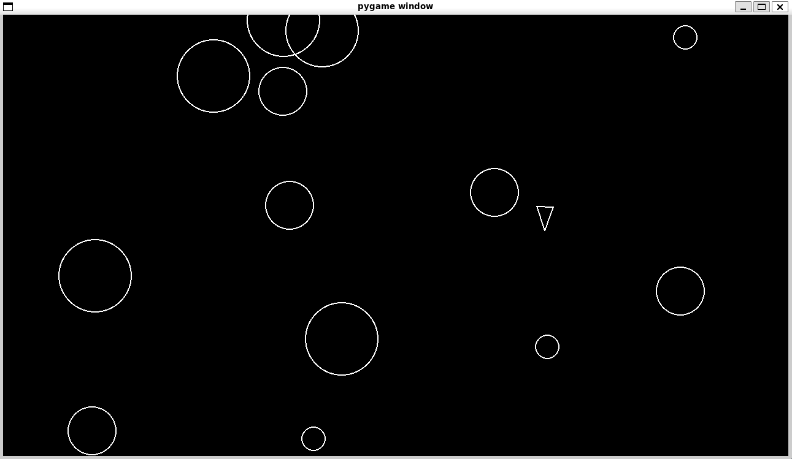

# Asteroids Game

This is a simple Asteroids game implemented in Python using the Pygame library. The player controls a spaceship, dodges and shoots asteroids, and tries to survive as long as possible. The game features:

- Player movement and shooting
- Asteroid field with splitting asteroids
- Collision detection between player, asteroids, and shots
- Basic game loop and game over condition

The main purpose of this project is to demonstrate knowledge of Python, OOP principles and library usage, also it has GitHub Actions for testing the Pygame installation and running the game.

## How to Run

1. Make sure you have Python 3 and Pygame installed.
2. Install dependencies:
   ```bash
   pip install -r requirements.txt
   ```
3. Run the game:
   ```bash
   python3 main.py
   ```

## Screenshot



## About

This project was made for the boot.dev platform.
